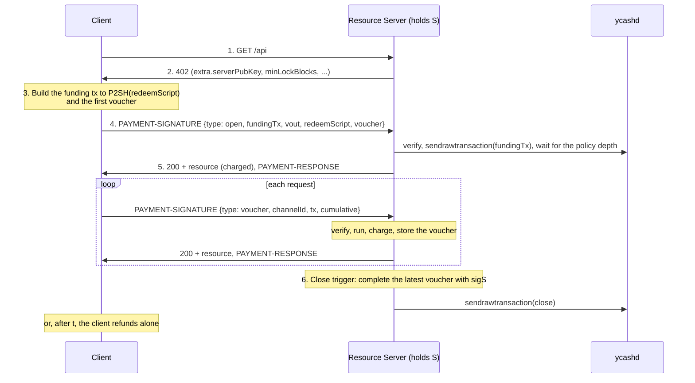

# Scheme: `batch-settlement` on Ycash

> Companion to the network-agnostic
> [`scheme_batch_settlement.md`](https://github.com/x402-foundation/x402/blob/main/specs/schemes/batch-settlement/scheme_batch_settlement.md).
> Network ids, assets, address forms, the fee rule and the confirmation policy are those of
> [`scheme_exact_ycash.md`](./scheme_exact_ycash.md).

## Summary

`batch-settlement` on Ycash is a **capital-backed** binding built on a one-way **payment channel**
held in a P2SH output, with no contract and no node change. The client locks a deposit once, in a
2-of-2 output that it can recover alone after a refund height. For each request it signs a
**voucher**: a complete transaction that spends the channel and pays the server a cumulative
amount. The server keeps the latest voucher and serves immediately. Later it adds its own
signature to the latest voucher and broadcasts it, collecting every request of the session in one
transaction. Two on-chain transactions carry any number of requests.

The binding has two assets:

- **YEC** channels, in zatoshis (plan X2).
- **YED** channels, in cents (plan X3). Each voucher carries a Yellowback TRANSFER. A YED output
  can never hold less than $1.00, so YED channels follow the **dollar floor**: the first voucher
  pre-pays at least $1.00, and a client remainder below $1.00 goes to the server. This is how
  Ycash prices YED requests below $1.00.

The scheme supports dynamic pricing: `amount` is the per-request ceiling and the server charges
the actual price, which it reports in `PAYMENT-RESPONSE`.

What the channel relies on, on both node lines (Ycash 4.5.0 and 6.21.0): P2SH spends of a
non-template script are standard up to 15 signature operations; `OP_CHECKLOCKTIMEVERIFY` is
enforced; and YED may sit in any output script. Ycash has no CSV and does not need it, because
the refund is a script branch, not a pre-signed transaction
([Appendix A](#appendix-a-node-behaviour-this-binding-relies-on)).

## Mapping the generic requirements

| Generic requirement | Ycash mechanism |
|---|---|
| One-time capital commitment | A funding transaction pays D to the P2SH address of the channel script. |
| Per-request authorization | A voucher: a transaction spending the channel outpoint, signed by the client's key C with `SIGHASH_ALL`, paying `payTo` the cumulative amount. |
| Monotonic amount | The server's charged total, compare-and-set on the stored voucher; only the highest voucher is ever broadcast. |
| Batched redemption | The server completes the latest voucher with its key S and broadcasts it: one close per channel. |
| Recipient binding | The voucher's outputs are fixed by the client's `SIGHASH_ALL` signature. |
| Recovery of unused deposit | The refund branch: after height t the client spends the channel alone. |

## Channel Script

### Redeem script

With C the client's compressed public key (33 bytes), S the server's (`extra.serverPubKey`) and
t the refund height:

```text
OP_IF
    OP_2 <C> <S> OP_2 OP_CHECKMULTISIG
OP_ELSE
    <t> OP_CHECKLOCKTIMEVERIFY OP_DROP <C> OP_CHECKSIG
OP_ENDIF
```

Byte for byte:

```text
63 52 21 <C:33> 21 <S:33> 52 ae 67 <push(t)> b1 75 21 <C:33> ac 68
```

- `<push(t)>` is t as a minimal `CScriptNum` push (the encoding `CScript << int64` writes): for a
  height from 65,536 to 8,388,607 it is `03` followed by three little-endian bytes. t is a block
  height, so 0 < t < 500,000,000.
- C and S are compressed keys (prefix `02` or `03`), and C ≠ S.
- The script is 115 bytes for a three-byte t. The funding output is the P2SH script
  `a9 14 <HASH160(redeemScript)> 87`.

Example, with illustrative keys C = `02c1…c1`, S = `035e…5e` and t = 3,101,234 (`32522f`):

```text
63522102c1c1c1c1c1c1c1c1c1c1c1c1c1c1c1c1c1c1c1c1c1c1c1c1c1c1c1c1c1c1c1c121035e5e5e5e5e5e5e5e5e5e5e5e5e5e5e5e5e5e5e5e5e5e5e5e5e5e5e5e5e5e5e5e52ae670332522fb1752102c1c1c1c1c1c1c1c1c1c1c1c1c1c1c1c1c1c1c1c1c1c1c1c1c1c1c1c1c1c1c1c1ac68
HASH160 = 2a658b51612cf2df64fe5375e8253bdec61f3c64
```

### Spends

| Spend | scriptSig | Who | When |
|---|---|---|---|
| **close** (a completed voucher) | `OP_0 <sigC> <sigS> OP_1 <redeemScript>` | the server, completing a client-signed voucher | any time; the server closes before t − `closeMarginBlocks` |
| **refund** | `<sigC> OP_0 <redeemScript>` | the client alone | from height t: the transaction's `nLockTime` ≥ t (a height) and its input's `nSequence` < 0xFFFFFFFF |

- `OP_0` first in the close is CHECKMULTISIG's extra stack item; it must be empty (NULLDUMMY is a
  standard flag). The signatures are in key order: C, then S.
- `OP_1` selects the IF branch and `OP_0` the ELSE branch, the minimal pushes (MINIMALDATA).
- Both spends leave exactly one true item on the stack (CLEANSTACK).
- The redeem script is pushed with `OP_PUSHDATA1` (it is over 75 bytes). The close scriptSig is
  about 265 bytes, under the 1,650-byte standard limit.
- The script counts 3 signature operations (2 for the 2-of-2, 1 for the refund), under the
  15-operation P2SH limit, so both spends are standard everywhere.
- A refund with `nLockTime` = t can enter the mempool once the tip is at height t, since a
  transaction is final when its lock height is below the next block's height.

Every signature is DER with low S, followed by the hash type `0x01` (`SIGHASH_ALL`), over the
ZIP-243 signature hash with the redeem script as the script code, the channel output's value as the
amount, and the consensus branch id current at signing. The node's stock signer cannot sign a
non-template script, so the client and server SDKs compute the hash and assemble both scriptSigs
themselves, as Ycash's own atomic-swap code does.

The refund is a script branch, not a pre-signed transaction. Nothing depends on a txid before it
is mined, so transaction malleability does not matter, and the binding needs no CSV.

### Channel id

`channelId` is the funding outpoint, `"<funding txid>:<vout>"`, the txid in display order.

## Channel Lifecycle



1. **Open.** The client creates C, builds the redeem script with S and a refund height t, and
   builds a funding transaction paying the P2SH address. It sends the funding transaction and the
   first voucher in an `open` payload. The server verifies both, relays the funding transaction
   (or finds it already relayed), and accepts vouchers once the funding transaction reaches the
   funding policy depth.
2. **Vouchers.** For each request the client signs a voucher for `cumulative`, the server's charged
   total so far plus `amount` (the ceiling). The server verifies it, runs the handler, charges the
   actual price, and stores the voucher if it is the highest so far.
3. **Close.** On a close trigger the server completes the highest voucher with its signature and
   broadcasts it. The channel is then spent; the client opens a new channel to continue.
4. **Refund.** If the server never closes, the client recovers the whole channel from height t.

## `PaymentRequirements`

```json
{
  "scheme": "batch-settlement",
  "network": "ycash:mainnet",
  "asset": "YEC",
  "amount": "2000",
  "payTo": "s1VgKr7cDvKvW2T4Lg3xJbWhAa2UZxnZQ3m",
  "maxTimeoutSeconds": 300,
  "extra": {
    "serverPubKey": "035e5e5e5e5e5e5e5e5e5e5e5e5e5e5e5e5e5e5e5e5e5e5e5e5e5e5e5e5e5e5e5e",
    "minLockBlocks": 1152,
    "closeMarginBlocks": 96,
    "maxDeposit": "100000000",
    "closeFee": "1500",
    "areFeesSponsored": false,
    "confirmationPolicy": { "confirmations": 1 }
  }
}
```

| Field | Required | Constraint |
|---|---|---|
| `amount` | yes | the per-request ceiling, in zatoshis (YEC) or cents (YED); positive |
| `payTo` | yes | the server's receiving address: transparent P2PKH or P2SH (YEC), `ye…` (YED) |
| `extra.serverPubKey` | yes | S, 66 lowercase hex characters, a compressed secp256k1 key |
| `extra.minLockBlocks` | yes | the least t − tip the server accepts at open; default 1152 (about 24 hours at 75 seconds) |
| `extra.closeMarginBlocks` | yes | the server stops accepting vouchers at t − `closeMarginBlocks` and closes; default 96 (about 2 hours); MUST be less than `minLockBlocks` |
| `extra.maxDeposit` | yes | the largest D the server accepts, in the asset's unit |
| `extra.closeFee` | yes | the fee, in zatoshis, every voucher (and so the close) pays; at least the close transaction's fee floor (below) |
| `extra.areFeesSponsored` | no | MUST be `false` when present |
| `extra.confirmationPolicy.confirmations` | no | the depth the funding transaction must reach before the first voucher is accepted; −1 to 20; default 1. −1 (mempool) is a server opt-in for small YEC channels; **YED channels require at least 0** (below). |
| `extra.assetTransferMethod` | no | not used: the binding has one method |

`closeFee` is the [fee rule](./scheme_exact_ycash.md#transaction-construction-transparent) applied
to the close transaction: one input of about 308 bytes (a ~265-byte scriptSig, so 3 logical
actions) and two outputs, plus an `OP_RETURN` for YED, so 1,500 zatoshis on both node lines. Like
the `exact` floor it is SDK and server policy, not a node rule (neither line enforces ZIP-317 at
relay). A server MAY set more.
The client reserves it inside the channel output, so the client pays both the funding fee and the
close fee.

## Payload Types

### `open`

```json
{
  "x402Version": 2,
  "accepted": { "scheme": "batch-settlement", "network": "ycash:mainnet", "asset": "YEC", "amount": "2000", "payTo": "s1VgKr7cDvKvW2T4Lg3xJbWhAa2UZxnZQ3m", "maxTimeoutSeconds": 300, "extra": { "serverPubKey": "035e…5e", "minLockBlocks": 1152, "closeMarginBlocks": 96, "maxDeposit": "100000000", "closeFee": "1500" } },
  "payload": {
    "type": "open",
    "fundingTx": "0400008085202f8901…",
    "vout": 0,
    "redeemScript": "63522102c1…c1ac68",
    "voucher": {
      "tx": "0400008085202f89019f…",
      "cumulative": "2000"
    }
  }
}
```

- `fundingTx`: the complete funding transaction, client-signed, lowercase hex. It follows the
  [`exact` construction rules](./scheme_exact_ycash.md#transaction-construction-transparent)
  except the expiry window, and pays V zatoshis to the P2SH script of `redeemScript` at `vout`.
  The client MAY have broadcast it already.
- `redeemScript`: lowercase hex of the channel script.
- `voucher`: the first voucher, as below.

### `voucher`

```json
{
  "x402Version": 2,
  "accepted": { "…": "…" },
  "payload": {
    "type": "voucher",
    "channelId": "7d3a…e91c:0",
    "tx": "0400008085202f89017d3a…",
    "cumulative": "26000"
  }
}
```

- `cumulative`: decimal string, the total the voucher pays the server.
- `tx`: lowercase hex of a v4 transaction with:
  - exactly one input, the channel outpoint, whose scriptSig is the close skeleton with the
    client's signature in place and the server's slot empty: `OP_0 <sigC> OP_0 OP_1 <redeemScript>`;
  - `nLockTime` 0 and `nExpiryHeight` 0 (a voucher must stay valid until the server closes, so it
    never expires);
  - no shielded components;
  - the outputs of [Voucher outputs](#voucher-outputs).

  The server replaces the empty slot with `<sigS>` to complete it. Since the client signed
  `SIGHASH_ALL`, the outputs cannot change.

### `close` (optional, client-initiated)

`{ "type": "close", "channelId", "tx", "cumulative" }`: a voucher whose `cumulative` equals the
server's charged total, sent without a resource request, asking the server to close now. A server
SHOULD accept it (it pays the server everything it charged) and broadcast it at once; the client
gets its remainder without waiting for t. The protected resource is not run.

### Voucher outputs

**YEC** (V the channel output's value):

| Vout | Script | Value |
|---|---|---|
| 0 | `payTo` | `cumulative`, plus the client remainder when that is below the dust threshold |
| 1 | the client's choice (not `payTo`) | V − `closeFee` − `cumulative`, omitted when below the dust threshold (54 zatoshis) |

So `cumulative` is at least 54 zatoshis from the first voucher on (an output below the dust
threshold is non-standard), and at most V − `closeFee`. The deposit is D = V − `closeFee`.

**YED**: see [YED channels](#yed-channels).

## Verification

### `open`

The server (or a facilitator's `/verify`) MUST check:

1. The envelope, as in [`exact`](./scheme_exact_ycash.md#facilitator-verification-rules-transparent) rule 1.
2. `redeemScript` parses as exactly the channel script; its S equals `extra.serverPubKey`; C is a
   compressed key different from S; t is a height with t ≥ tip + `minLockBlocks`.
3. `fundingTx` decodes as in `exact` rule 3, and its output `vout` is the P2SH script of
   `redeemScript` with value V.
4. The deposit D (V − `closeFee` for YEC; the assigned cents for YED) is at most `maxDeposit`.
5. The funding inputs are unspent: `exact` rule 6, or, if the client already broadcast it, the
   funding output is found by `gettxout(txid, vout, true)`.
6. The fee floor (`exact` rule 7) and the scripts (`exact` rule 9) hold for the funding
   transaction.
7. The first voucher passes voucher rules 4 to 7 below, against this channel.

The server then relays the funding transaction with `sendrawtransaction` and records the channel.
It accepts the first voucher, and serves the request that carried the `open`, once the funding
transaction reaches the funding policy depth, observed with `gettxout(txid, vout, true)`; voucher
rules 1 to 3 and 8 (and, for YED, the overlay checks) are applied at that point. Below the depth
`/settle` returns `settlement_pending` with the funding txid, and the retry resumes observing.

### `voucher` (per request, before the handler runs)

1. **Known and open.** The channel is recorded and not closing.
2. **Margin.** tip < t − `closeMarginBlocks`. Otherwise the voucher is refused and the server
   closes the channel.
3. **Unspent.** `gettxout(channel txid, vout, true)` still finds the channel output: neither a close
   nor a refund has been broadcast.
4. **Shape.** The transaction is as in [`voucher`](#voucher): one input, the channel outpoint,
   `nLockTime` 0, `nExpiryHeight` 0, no shielded components, and the outputs exactly as in
   [Voucher outputs](#voucher-outputs) for this `cumulative`.
5. **Amount.** charged + `amount` ≤ `cumulative` ≤ D, where charged is the server's charged total
   for this channel. Dynamic pricing may then charge less than `amount`.
6. **Client signature.** sigC is a valid low-S `SIGHASH_ALL` signature by C over the voucher's
   ZIP-243 hash (script code the redeem script, amount V).
7. **Complete.** With sigS added, `signrawtransaction hex [] []` returns `complete: true`.
8. **Store.** Compare-and-set: the voucher is stored only if `cumulative` is at least the stored
   voucher's, and only one voucher per channel is in flight at a time.

After the handler succeeds, the server adds the actual charge (≤ `amount`) to charged. If the
handler fails, the charged total is unchanged and the client may resend the same voucher.

### Close triggers

The server completes and broadcasts its highest voucher when any of these holds:

- the session idles (a server-chosen timeout);
- tip ≥ t − `closeMarginBlocks`;
- `cumulative` reaches D (the channel is exhausted), or, for YED, the client remainder would fall
  below $1.00;
- the client sends a `close` payload;
- on the server's own schedule.

The close is broadcast with `sendrawtransaction` and observed with `gettxout` on the server's
output. The server MUST close before t: from t the client can refund, and whichever spend is mined
first wins.

## Settlement

`/settle` per payload type:

| Type | Effect | `transaction` | Commitment id |
|---|---|---|---|
| `open` | relay the funding transaction; store the channel and the first voucher | the funding txid | `"<channelId>@<cumulative>"` |
| `voucher` | store the voucher; no transfer | `""` | `"<channelId>@<cumulative>"` |
| `close` | broadcast the client's closing voucher, completed | the close txid | `"<channelId>@<cumulative>"` |
| `claim` | server to facilitator: broadcast a voucher the server completed | the close txid | `"<channelId>@<cumulative>"` |

Response:

```json
{
  "success": true,
  "transaction": "",
  "network": "ycash:mainnet",
  "payer": "7d3a…e91c:0",
  "amount": "",
  "extra": {
    "commitmentId": "7d3a…e91c:0@26000",
    "chargedAmount": "1700",
    "channelState": {
      "channelId": "7d3a…e91c:0",
      "deposit": "1000000",
      "chargedCumulative": "25700",
      "signedCumulative": "26000",
      "refundHeight": 3101234,
      "closeMarginBlocks": 96
    }
  }
}
```

`payer` is the channel id: the channel, not an address, is the payer's identity. `chargedAmount` is
this request's charge; the client signs its next voucher at `chargedCumulative` + `amount`
(at least $1.00 for YED). A client whose stored state disagrees resynchronises from
`channelState`; a server that rejects a voucher for a wrong `cumulative` returns
`invalid_batch_settlement_ycash_cumulative_mismatch` with `channelState` in the corrective 402.

**Claiming less than the latest voucher is not possible.** The voucher is a signed transaction with
fixed outputs, so a close pays exactly its `cumulative`. With dynamic pricing the highest voucher
can exceed the charged total by up to one `amount` minus that request's actual charge. A server
SHOULD close with a client `close` voucher at exactly the charged total when it gets one; otherwise
it closes with its highest voucher, and the client has pre-paid that difference.

## Client Refund

If the server does not close, the client spends the channel alone from height t:

- one input, the channel outpoint, `nSequence` 0xFFFFFFFE, scriptSig `<sigC> OP_0 <redeemScript>`;
- `nLockTime` = t (or any height from t to the current tip);
- outputs to the client totalling V minus a fee at the fee floor;
- for a YED channel, a TRANSFER assigning all of D to a client output (see below), never a bare
  spend.

The client tooling watches the channel and warns at t − `closeMarginBlocks`, and offers `channel
open|status|refund`.

## YED Channels

A YED channel is the YEC channel with these changes. It REQUIRES a Yellowback node on the server's
side (`-experimentalfeatures -yellowback`) to verify vouchers.

**Funding.** A TRANSFER (see [`exact`, YED](./scheme_exact_ycash.md#transaction-construction-transparent))
that assigns D cents to the P2SH output, with D in [100, 10,000,000] and D ≤ `maxDeposit`. The
client's YED change is 0 or at least $1.00. The P2SH output carries V = 2 × `TOKEN_VALUE` +
`closeFee` = 21,500 zatoshis at the defaults, which pays the two voucher outputs' YEC and the close
fee. There is no P2SH Yellowback address (a `ye…` address is P2PKH only) and the node's
`yed_send` refuses one, so the client SDK builds the funding transaction itself.

**Funding depth.** The overlay records the channel's token record only when the funding
transaction is in a block, and `yed_validaterawtransaction` reads confirmed records only, so a
voucher spending an unconfirmed channel shows `yedIn` 0. YED channels therefore require
`confirmations` ≥ 0 (in a block); the zero-confirmation opt-in is for YEC channels only.

**Voucher outputs.**

| Vout | Script | YEC value | YED assignment |
|---|---|---|---|
| 0 | P2PKH of `payTo`'s key hash | `TOKEN_VALUE` | serverCents |
| 1 | the client's choice (not `payTo`) | `TOKEN_VALUE` | clientCents, or none when it is 0 |
| 2 | `OP_RETURN` TRANSFER | 0 | — |

The fee is V − 2 × `TOKEN_VALUE` = `closeFee`. Output 1 always exists, so the shape is constant; it
carries plain YEC when clientCents is 0.

**The dollar floor (X-7).** With charged the server's charged total:

- `cumulative` = max(100, charged + `amount`): it is at least $1.00 from the first voucher on. The
  first voucher pre-pays up to $1.00 that later requests consume; the server keeps its charged
  total under the voucher's `cumulative`.
- The split of D at `cumulative` is: if D − `cumulative` ≥ 100, serverCents = `cumulative` and
  clientCents = D − `cumulative`; otherwise serverCents = D and clientCents = 0. A client
  remainder in (0, $1.00) goes to the server, never to a burn. The client sizes D to keep that
  rare, and the server closes when the next voucher would reach it.
- So serverCents + clientCents = D: yedOut equals yedIn and nothing burns.

The split, the floor and their vectors are in the SDK's `yed` module
(`yedChannelSplit`, `isValidYedVoucherCumulative`) and `vectors/yed/dollar_floor.json`.

**Payload on every spend.** A YED spend without a valid TRANSFER burns its YED. The funding
transaction, every voucher (and so the close), the client's `close` and the refund each carry a
TRANSFER payload. The refund assigns all of D to its client output.

**Verification adds,** for every voucher, after completing it with sigS:

- `yed_decodepayload(tx)` returns a `transfer` whose assignments are exactly the split above, at
  `opReturnIndex` 2;
- `yed_validaterawtransaction(tx)` reports `valid` true, `type` `"transfer"`, `verdict` `"OK"`,
  `burned` 0, `yedIn` = D, `yedOut` = D and `unconfirmedInputs` empty.

`amount` and `cumulative` are in cents; `closeFee` and V are in zatoshis.

Yellowback's halts stop mints only, never transfers, so YED channels keep working through a halt.

## The Seven Network Requirements

| # | Requirement | Ycash answer |
|---|---|---|
| 1 | **Commitment format** | A voucher: a v4 transaction spending the channel outpoint, with the client's `SIGHASH_ALL` signature in the close scriptSig, paying `payTo` the cumulative amount and the client the rest (with a TRANSFER payload for YED), in the `voucher` payload with its `channelId` and `cumulative`. |
| 2 | **Verification rules** | The eight voucher steps: channel known and open, margin, channel output unspent, exact outputs, amount bounds, the client's signature over the ZIP-243 hash, completion verified by the node's script verifier, compare-and-set; plus the overlay verdict for YED. Replay is prevented by the single channel outpoint; expiry by the refund height. |
| 3 | **Storage behaviour** | The server stores the highest voucher per channel and its charged total. The commitment identifier is `"<channelId>@<cumulative>"`. |
| 4 | **Double-spend prevention** | Every voucher spends the same outpoint, so only one can ever be mined. The server broadcasts only its highest, keeps one voucher per channel in flight, and stops accepting vouchers at t − `closeMarginBlocks` so its close lands before the client's refund becomes valid. |
| 5 | **Commitment expiry** | A voucher never expires (`nExpiryHeight` 0) and is usable until t. From t the client can refund, and an unclosed voucher can lose the race. Vouchers not accepted by the server are simply never broadcast. |
| 6 | **Redemption** | The server, through a close: it completes the highest voucher with sigS and broadcasts it on a close trigger (idle, margin, exhausted, client `close`, schedule). The rail is a Ycash transaction, broadcast directly or through a facilitator's `/settle` (`claim`). |
| 7 | **Trust model** | Capital-backed. The deposit sits in the channel output, which the client cannot move alone before t. The server's guarantee is a voucher it can complete and broadcast at any time before t; its risk is failing to close before t. |

## What This Binding Cannot Match

These are features of the EVM and SVM channel bindings, not generic requirements:

- **Top-up** into the same channel. A channel is one output; the client opens a new channel.
- **Partial cooperative refund with reuse.** A spend consumes the channel; the client's `close`
  returns the whole remainder and ends the channel.
- **Claiming less than a signed voucher.** A voucher's outputs are fixed; see the dynamic-pricing
  note in [Settlement](#settlement).
- **Facilitator-sponsored fees or rent.** The client pays the funding fee and reserves the close
  fee in the channel (`areFeesSponsored` false).

## Error Codes

The core codes apply. Scheme-specific codes:

| Code | Meaning |
|---|---|
| `invalid_batch_settlement_ycash_payload_type` | the `type` is not valid for the operation |
| `invalid_batch_settlement_ycash_redeem_script` | not the channel script, wrong S, C = S, or t below tip + `minLockBlocks` |
| `invalid_batch_settlement_ycash_funding` | the funding transaction fails the `exact` rules or does not pay the P2SH script |
| `invalid_batch_settlement_ycash_deposit_too_large` | D above `maxDeposit` |
| `invalid_batch_settlement_ycash_funding_depth` | the funding transaction has not reached the funding depth |
| `invalid_batch_settlement_ycash_unknown_channel` | no open channel with that id |
| `invalid_batch_settlement_ycash_channel_closing` | tip ≥ t − `closeMarginBlocks`, or the channel output is spent |
| `invalid_batch_settlement_ycash_voucher_shape` | inputs, lock time, expiry or outputs differ from the rules |
| `invalid_batch_settlement_ycash_cumulative_mismatch` | `cumulative` is below charged + `amount` (corrective 402) |
| `invalid_batch_settlement_ycash_cumulative_exceeds_deposit` | `cumulative` above D |
| `invalid_batch_settlement_ycash_stale_voucher` | `cumulative` below the stored voucher's |
| `invalid_batch_settlement_ycash_voucher_signature` | sigC invalid, high-S or not `SIGHASH_ALL` |
| `invalid_batch_settlement_ycash_script` | the completed voucher fails the node's script verifier |
| `invalid_batch_settlement_ycash_yed_floor` | a YED voucher breaks the dollar floor or its split |
| `invalid_batch_settlement_ycash_yed_verdict` | the overlay's verdict is not OK, or something burns |
| `invalid_batch_settlement_ycash_yed_node_required` | a YED channel at a server without a Yellowback node |

## Security Considerations

- **The server's deadline.** A server that does not close before t can lose everything charged to
  the client's refund. The margin and a watcher on tip height are REQUIRED for a server.
- **Funding at zero confirmations.** A server that accepts vouchers before the funding transaction
  is mined can be served a funding transaction that is then double-spent. The opt-in is for small
  YEC channels only.
- **Bounded authorization.** The client's exposure is the latest voucher it signed, never more than
  D; each voucher pays at most one `amount` beyond what the server charged.
- **Burned YED.** Every YED spend of the channel carries a TRANSFER that assigns all of D; the
  server's verify refuses any other verdict, and the client's refund builder never omits the
  payload.
- **Key handling.** Channel keys are SDK keys. They are never imported into a node wallet (whose
  signer cannot spend the channel script anyway).

## Appendix A: Node behaviour this binding relies on

Checked on 2026-10-03 against `ycash-dd` (Ycash 4.5.0 with the Yellowback overlay) and `ycash6`
(Ycash 6.21.0-rc1). "Same" means the same code at the same line. The `exact` binding's Appendix A
holds the rows shared with it (relay, expiry, `gettxout`, the script verifier, fees, dust, the
payload codec).

| # | Behaviour | `ycash-dd` (4.5.0) | `ycash6` (6.21.0) |
|---|---|---|---|
| S-1 | A P2SH spend of a non-template script is standard with ≤ 15 sigops (`MAX_P2SH_SIGOPS`) | `src/policy/policy.cpp:174-179`, `src/policy/policy.h:24` | `src/policy/policy.cpp:204-209`, `src/policy/policy.h:37` |
| S-2 | CLTV is a standard and consensus flag; it needs a height lock time ≥ t and a non-final `nSequence` | `src/policy/policy.h:32-40`, `src/main.cpp:2936`, `src/script/interpreter.cpp:346`, `:1307-1338` | `src/policy/policy.h:45-53`, `src/main.cpp:3413`, `src/script/interpreter.cpp:349`, `:1416` |
| S-2a | A transaction is final when its lock height is below the next block's height | `src/main.cpp:722` | `src/main.cpp:779` |
| S-3 | No CSV: `OP_NOP3` is a NOP, discouraged by policy | `src/script/interpreter.cpp:388-393` | `:391-395` |
| S-5 | scriptSig push-only, ≤ 1,650 bytes | `src/policy/policy.cpp:89-100` | `src/policy/policy.cpp:116-124` |
| S-7 | NULLDUMMY, MINIMALDATA, CLEANSTACK and LOW_S are standard flags | `src/policy/policy.h:32-40` | `src/policy/policy.h:45-53` |
| R-8 | The stock signer cannot sign a non-template script (`SignStep` false for `TX_NONSTANDARD`); hand-assembled P2SH scriptSigs are precedent | `src/script/sign.cpp:84-86`, `:288-292`; `src/script/atomicswap.cpp:151-185` | same |
| Y-1 | Transfer rules ignore the script type: YED may sit in a P2SH output | `src/yellowback/state.cpp:443-474` | same |
| Y-2 | `yedIn` sums the token records of the spent outpoints, whatever their script | `src/yellowback/state.cpp:797-810` | `:797-808` |
| Y-3 | Each YED output in [100, 10000000] cents, or everything burns | `src/yellowback/params.cpp:18-19`, `src/yellowback/state.cpp:447-449` | same |
| Y-4 | A YED spend without a valid payload burns its YED | `src/yellowback/state.cpp:860-865`, `:879-883` | same |
| Y-6 | `MempoolCheck` refuses only spends of ACTIVE vaults: channel transactions relay | `src/yellowback/index.cpp:726-735` | `:774-778` |
| Y-8 | No P2SH Yellowback address; `yed_send` refuses non-`ye…` | `src/yellowback/address.cpp:11-27`, `src/rpc/yellowbackwallet.cpp:145-149` | same |
| Y-9 | `yed_validaterawtransaction` evaluates against the index tip (confirmed token records) and lists unconfirmed inputs | `src/rpc/yellowback.cpp:1429-1488` | `:1428` |
| Y-12 | `TOKEN_VALUE` = 10,000 zatoshis per wallet-built YED output | `src/yellowback/params.h:78` | same |
