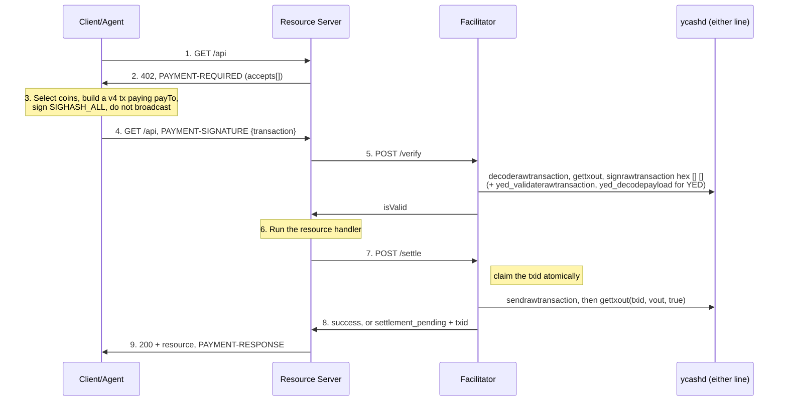

# Scheme: `exact` on Ycash

## Summary

This document specifies the `exact` payment scheme of x402 v2 for Ycash, a Zcash-lineage UTXO
chain with a transparent pool and a Sapling shielded pool. It covers two assets, chosen with
`PaymentRequirements.asset`:

- **YEC**, the chain's native coin, in zatoshis (10⁻⁸ YEC).
- **YED**, the dollar of Ycash Yellowback (YED), in cents. Yellowback is an overlay on the node,
  not a contract: a YED amount lives on a transparent output, recorded by every Yellowback node
  from a payload in the transaction's single `OP_RETURN`.

There are three asset transfer methods, chosen with `extra.assetTransferMethod`:

| Method | Asset | Family | Flow | What the client sends |
|---|---|---|---|---|
| `transparent` | `YEC` | facilitator-submitted | `authorization` | a complete signed v4 transaction, not broadcast |
| `transparent` | `YED` (≥ $1.00) | facilitator-submitted | `authorization` | a complete signed v4 transaction carrying a Yellowback TRANSFER, not broadcast |
| `sapling-proof` | `YEC` | client-submitted (payment proof) | `upfront` | the txid of a shielded payment it already sent to a per-request address |

A fourth method, a facilitator-submitted shielded payment (`sapling`, plan X4b), is **reserved,
not yet specified** (see [Reserved methods](#reserved-methods)).

Ycash has no smart contracts, no signed-transfer authorization, no account nonces and no CSV. This
binding needs none of them. Like the Cardano binding, it uses the UTXO set as its replay primitive
and a transaction field as its validity window: here `nExpiryHeight`, which Overwinter-era
transactions carry natively. The payer funds the network fee inside the transaction it signs, as
on Cardano and XRPL.

Example use cases: an agent paying a few cents of YEC per API call; a tool priced in dollars and
paid in YED at $1.00 or more per call; a payment for a dataset that reveals neither payer, payee
nor amount on chain.

Payments of YED below $1.00 per request use the [`batch-settlement` binding](./scheme_batch_settlement_ycash.md)
(payment channels), because a Yellowback output can never hold less than $1.00.

**No node change.** Every transaction this scheme produces is a standard transparent v4
transaction or a standard Sapling transaction. Node operators and pool operators on either node
line (Ycash 4.5.0 and 6.21.0) relay and mine them with no flag, configuration or upgrade
([Appendix B](#appendix-b-optionality-for-node-and-pool-operators)).

## Network Identifiers

| `network` | Chain (`getblockchaininfo.chain`) | Assets |
|---|---|---|
| `ycash:mainnet` | `main` | `YEC`; `YED` from Yellowback's mainnet start height 3,075,000 |
| `ycash:testnet` | `test` | `YEC`; `YED` once testnet has a Yellowback start height |
| `ycash:regtest` | `regtest` | `YEC`, `YED` |

These ids are valid CAIP-2 syntax over the `ycash` namespace, which is **not** a registered
ChainAgnostic namespace, following Cardano's `cardano:mainnet` form. The genesis-hash form of the
bip122 convention (used by `lnbtc:`) **cannot** be used: Ycash forked from Zcash and its three
genesis blocks are Zcash's, so a genesis-hash reference would name Zcash too
([Appendix A](#appendix-a-node-behaviour-this-binding-relies-on), G-1).

A facilitator MUST reject a `network` that does not match the chain its node reports. A client
SHOULD check the same against its own node or light server. The node software line (4.5.0 or
6.21.0) is not part of the network id: both lines are the same network and validate the same
transactions.

## Assets and Amounts

| `asset` | Atomic unit | `amount` | Recipient (`payTo`) |
|---|---|---|---|
| `YEC` | zatoshi | positive decimal integer string, ≥ 54 for `transparent` (the dust threshold of a P2PKH output) | `transparent`: a transparent address; `sapling-proof`: a Sapling address |
| `YED` | cent | decimal integer string in [100, 10000000] ($1.00 to $100,000) | a Yellowback address |

Assets are symbols, not contract ids: neither asset has a contract address. Address forms per
network:

| Address | `ycash:mainnet` | `ycash:testnet` | `ycash:regtest` |
|---|---|---|---|
| transparent P2PKH / P2SH | `s1…` / `s2…` or `s3…` | `sm…` / `s2…` | `sm…` / `s2…` |
| Yellowback (YED, P2PKH only) | `ye…` | `yt…` | `yr…` |
| Sapling | `ys1…` | `ytestsapling1…` | `yregtestsapling1…` |

**Client spend controls.** YED is a dollar (cents, 2 decimals), so a client SDK recognises it as
a default asset (the TypeScript SDK's `findDefaultAsset` returns it) and its USD spend cap
applies. YEC is not USD-pegged: treating it as a default asset would make a "$1" cap mean 1 YEC.
An agent that pays YEC therefore adds an explicit `allowedAssets` entry for `YEC` on the network
with a per-payment cap in zatoshis (the SDK's `yecSpendControl(network, maxZat)`); without one,
the client refuses every YEC requirement.

Ycash's transparent addresses are not Zcash's `t1…`/`t3…`: the node decodes only its own
prefixes. A `ye…` address encodes the same 20-byte key hash as an `s1…` address, so a YED output
is an ordinary P2PKH output; the different prefix exists so that YED is never sent to a wallet
that cannot see it.

Testnet and regtest share their transparent version bytes (P2PKH `1C 95`, P2SH `1C 2A`, and WIF
`0xEF`), so a transparent address alone cannot tell testnet from regtest. Clients and
facilitators MUST take the network from the requirements' `network` (checked against the node,
verification rule 2), never infer it from `payTo`. Yellowback addresses are distinct per network.

## Asset Transfer Methods and Payment Flow

### Family declarations

`scheme_exact.md` requires each method to state its family and answer that family's checklist.

**`transparent` (YEC and YED): facilitator-submitted.** The client signs a complete transaction
and does not broadcast it; the facilitator submits it during settle. The flow is `authorization`
(verify, then the resource, then settle); `extra.paymentFlow` is not emitted.

| Declaration | Answer |
|---|---|
| **Fee payer** | Self-funded by the payer. The fee is inside the signed transaction. `extra.areFeesSponsored` is `false`. |
| **Replay primitive** | The transaction's input outpoints. They are **shared with the payer's wallet state**: the payment is exclusive only as long as the payer's wallet does not spend the same coins elsewhere. So unrelated payer activity **can invalidate the payment after the resource handler ran** (the payer spends an input between verify and settle). The facilitator's mempool check (verification rule 6) narrows that to a race. There is no limit on concurrent pending payments beyond the payer's number of spendable coins: each pending payment holds its own inputs. |
| **Validity window** | Bounded by the transaction's `nExpiryHeight`, which every node enforces: an expired transaction is invalid in a block and refused at relay. Verification rule 8 bounds it by `maxTimeoutSeconds`. An expiry of 0 (never expires) is refused. |
| **Duplicate submission** | **Indistinguishable.** `sendrawtransaction` of a transaction already in the node's mempool returns its txid with no error. The facilitator MUST deduplicate settlements atomically (see [Duplicate Settlement Mitigation](#duplicate-settlement-mitigation-required)). |

It satisfies the family's requirements as follows. **Transfer correctness:** verification rules 4
(YEC) or 4Y (YED) require exactly one output to `payTo` of exactly `amount`. **Facilitator safety:**
the facilitator signs nothing and pays nothing. **Replay:** a spent input makes the node refuse the
transaction, and settle reports that as a failure, never as a success. **Duplicate delivery:** the
required txid claim.

**`sapling-proof` (YEC): client-submitted (payment proof).** The client sends a shielded payment
itself, to a Sapling address the server issued for this request only, and presents the txid. The
flow is `upfront`, as the family requires. The checklist is answered in
[`sapling-proof`](#sapling-proof-client-submitted-shielded-yec).

## Protocol Flow

`transparent`:



`sapling-proof`:

```mermaid
sequenceDiagram
    participant Client as Client/Agent
    participant Server as Resource Server (self-hosted facilitator)
    participant Wallet as Merchant ycashd wallet

    Client->>Server: 1. GET /api
    Server->>Wallet: z_getnewdiversifiedaddress
    Server->>Client: 2. 402, payTo = fresh ys1…, extra.memo = "x402:" + requestHash
    Note over Client: 3. Send amount to payTo with the memo<br/>(z_sendmany, YecWallet, any Sapling wallet)
    Client->>Server: 4. GET /api, PAYMENT-SIGNATURE {txid}
    Server->>Wallet: 5. z_listreceivedbyaddress(payTo, minconf)
    Note over Server: amount, memo, depth; claim ycash:<net>:<txid>@<payTo> atomically
    Server->>Client: 6. 200 + resource, PAYMENT-RESPONSE (+ signed receipt)
```

## `PaymentRequirements`

### Common fields

| Field | Value |
|---|---|
| `scheme` | `"exact"` |
| `network` | `ycash:mainnet`, `ycash:testnet` or `ycash:regtest` |
| `asset` | `"YEC"` or `"YED"` |
| `amount` | atomic units, see [Assets and Amounts](#assets-and-amounts) |
| `payTo` | an address of the form the method and asset require |
| `maxTimeoutSeconds` | the validity window; RECOMMENDED ≥ 300 (four blocks at the 75-second target spacing) |

`extra` fields:

| Field | Methods | Constraint |
|---|---|---|
| `assetTransferMethod` | all | `"transparent"` or `"sapling-proof"`. MAY be omitted, meaning `"transparent"`. |
| `areFeesSponsored` | all | optional; MUST be `false` when present |
| `confirmationPolicy.confirmations` | all | optional integer from −1 to 20; see below |
| `paymentFlow` | `sapling-proof` | REQUIRED, `"upfront"`. MUST be absent or `"authorization"` for `transparent`. |
| `memo` | `sapling-proof` | REQUIRED, `"x402:"` followed by 64 lowercase hex characters (the request hash) |
| `expiresAt` | `sapling-proof` | REQUIRED, Unix seconds after which the instrument is retired (issuance time + `maxTimeoutSeconds`) |

### Confirmation policy

`extra.confirmationPolicy.confirmations`, an integer from −1 to 20, as in Cardano's
`confirmationPolicy` (whose field is named `l1Confirmations`):

| Value | Meaning |
|---|---|
| −1 | accepted into the mempool of the facilitator's own node, by the facilitator's own broadcast |
| 0 | included in a block of the best chain |
| N (1..20) | N confirmations: the transaction's block and N − 1 blocks on top of it. This is the node's own `confirmations` count, so 1 is the same evidence as 0. |

An absent policy means −1 for a `transparent` YEC payment whose `amount` is at most the server's
zero-confirmation cap, and 1 otherwise. The cap is the server's choice; a suggested default is
the YEC equivalent of $1.00. A `transparent` YED payment defaults to 1, and so does
`sapling-proof`. Greater evidence satisfies a lower threshold, and a response reports the
strongest evidence observed.

Ycash's blocks come every 75 seconds on average. Under the `authorization` flow the server
responds only after settle, so each confirmation required adds about 75 seconds to the response.
That is why the default for small payments is mempool acceptance. The risk that comes with it
(the payer double-spends its own inputs after the handler ran) is bounded by the server's cap and
detected by the facilitator's mempool check. A server that cannot accept that risk sets 1.

A facilitator MAY refuse −1 unless its operator opted in. `/supported` advertises the range it
can settle (see [`/supported`](#supported)). The policy in force is always the one in the 402
requirements; a client MUST NOT infer it from `/supported`.

### `transparent`, YEC

```json
{
  "x402Version": 2,
  "error": "PAYMENT-SIGNATURE header is required",
  "resource": { "url": "https://api.example.com/search", "description": "One search", "mimeType": "application/json" },
  "accepts": [
    {
      "scheme": "exact",
      "network": "ycash:mainnet",
      "asset": "YEC",
      "amount": "250000",
      "payTo": "s1VgKr7cDvKvW2T4Lg3xJbWhAa2UZxnZQ3m",
      "maxTimeoutSeconds": 300,
      "extra": {
        "assetTransferMethod": "transparent",
        "areFeesSponsored": false,
        "confirmationPolicy": { "confirmations": -1 }
      }
    }
  ]
}
```

### `transparent`, YED

```json
{
  "scheme": "exact",
  "network": "ycash:mainnet",
  "asset": "YED",
  "amount": "2500",
  "payTo": "ye2Lq9GmV3Yx8kTzX1oR7bWcN4uPfHs6aJd",
  "maxTimeoutSeconds": 600,
  "extra": {
    "assetTransferMethod": "transparent",
    "areFeesSponsored": false,
    "confirmationPolicy": { "confirmations": 1 }
  }
}
```

### `sapling-proof`, YEC

```json
{
  "scheme": "exact",
  "network": "ycash:mainnet",
  "asset": "YEC",
  "amount": "1500000",
  "payTo": "ys1qq7y0g2y5rjv4rnq3q0n9e3n6m9h3z5s2v7k8w4p0x6c9d2f5g8h3j6k9m2n5p8r3t6v9x2z5a8c3e6f9g2h5j8",
  "maxTimeoutSeconds": 900,
  "extra": {
    "assetTransferMethod": "sapling-proof",
    "paymentFlow": "upfront",
    "areFeesSponsored": false,
    "memo": "x402:9f2c4a7e1b3d5f60718293a4b5c6d7e8f90a1b2c3d4e5f60718293a4b5c6d7e8",
    "expiresAt": 1791100800,
    "confirmationPolicy": { "confirmations": 1 }
  }
}
```

(The addresses in these examples are illustrative, not valid checksums.)

### `/supported`

```json
{
  "kinds": [
    {
      "x402Version": 2,
      "scheme": "exact",
      "network": "ycash:mainnet",
      "extra": {
        "assets": ["YEC", "YED"],
        "assetTransferMethods": ["transparent"],
        "areFeesSponsored": false,
        "confirmations": { "minimum": -1, "maximum": 20 }
      }
    }
  ],
  "extensions": [],
  "signers": {}
}
```

`signers` is empty: the facilitator signs nothing. A facilitator lists `YED` only when its node
runs with `-experimentalfeatures -yellowback` (verification rules 4Y and 9Y need the overlay's
RPCs). `sapling-proof` is listed only by a facilitator the merchant hosts itself, since it needs
the merchant's wallet ([Security Considerations](#viewing-key-custody)).

## `PaymentPayload`

### `transparent` (YEC and YED)

`payload.transaction`: the complete signed transaction, serialised as the node's
`sendrawtransaction` takes it, in lowercase hexadecimal.

```json
{
  "x402Version": 2,
  "resource": { "url": "https://api.example.com/search", "description": "One search", "mimeType": "application/json" },
  "accepted": {
    "scheme": "exact",
    "network": "ycash:mainnet",
    "asset": "YEC",
    "amount": "250000",
    "payTo": "s1VgKr7cDvKvW2T4Lg3xJbWhAa2UZxnZQ3m",
    "maxTimeoutSeconds": 300,
    "extra": { "assetTransferMethod": "transparent", "areFeesSponsored": false, "confirmationPolicy": { "confirmations": -1 } }
  },
  "payload": {
    "transaction": "0400008085202f8901…"
  }
}
```

There is no separate nonce field: every input of the transaction is a replay guard, and the
facilitator checks all of them (rule 6).

### `sapling-proof`

`payload.txid`: the txid of the shielded payment, 64 lowercase hex characters in the node's
display order.

```json
{
  "x402Version": 2,
  "accepted": { "scheme": "exact", "network": "ycash:mainnet", "asset": "YEC", "amount": "1500000", "payTo": "ys1…", "maxTimeoutSeconds": 900, "extra": { "assetTransferMethod": "sapling-proof", "paymentFlow": "upfront", "memo": "x402:9f2c…7e8", "expiresAt": 1791100800 } },
  "payload": { "txid": "5be1c7d0e8f3a2b4c6d8e0f1a3b5c7d9e1f3a5b7c9d1e3f5a7b9c1d3e5f7a9b1" }
}
```

## Transaction Construction (`transparent`)

The client builds a transaction with these properties. A facilitator rejects any other shape.

- **Format.** Transaction version 4 with the Overwintered flag and the Sapling version group id
  `0x892F2085`. Version 5 is refused by consensus on both node lines while NU5 has no activation
  height, so v4 is the format.
- **Transparent only.** No Sapling spends or outputs, no JoinSplits, `valueBalance` 0.
- **`nLockTime` 0.** Every input's `nSequence` is free (0xFFFFFFFF is usual).
- **`nExpiryHeight` = tip + 3 + ⌈`maxTimeoutSeconds` / 75⌉**, where tip is the height of the best
  block the client sees. The node refuses at relay a transaction whose expiry is closer than
  three blocks to the next block (`TX_EXPIRING_SOON_THRESHOLD`), so tip + 4 is the smallest
  useful value.
- **Signatures.** Every input signed `SIGHASH_ALL` with the ZIP-243 signature hash at the current
  consensus branch id (from `getblockchaininfo.consensus.nextblock`, or lightwalletd's
  `GetLightdInfo`). Signatures are low-S (standard on both lines).
- **Fee.** fee = Σ inputs − Σ outputs ≥ **max(1000, 500 × max(2, logical actions))** zatoshis,
  where logical actions = max(⌈Σ serialised input size / 150⌉, ⌈Σ serialised output size / 34⌉)
  (ZIP-317). It is 1000 zatoshis for a one-input, two-output payment. This floor is **SDK and
  facilitator policy, not a node rule**: neither node line enforces a ZIP-317 floor at relay
  (4.5.0 requires only its 100 zatoshis/kB minimum relay fee; 6.21.0 ships the ZIP-317 unpaid-action
  limits off). It is chosen to match Ycash 4.5.0's wallet default of 1000 zatoshis and to stay at
  or above 6.21.0's ZIP-317 conventional fee, below which 6.21.0 applies its ZIP-401 mempool
  eviction penalty.
- **Inputs.** Confirmed, unspent coins of the payer. For YEC, no input may hold YED (see rule
  9Y); a client SHOULD skip token-bearing coins in coin selection, using a Yellowback node or
  lightwalletd `GetAddressTokens` to recognise them.
- **Not broadcast.** The client hands the transaction to the server and MUST NOT broadcast it.

**YEC:** one output of exactly `amount` zatoshis to the P2PKH or P2SH script of `payTo`, change
to the payer.

**YED:** the transaction is a Yellowback TRANSFER:

- one output whose script is the P2PKH script of the key hash in `payTo` (the `ye…` address).
  Its YEC value is at least the dust threshold; wallets use `TOKEN_VALUE` = 10,000 zatoshis;
- token inputs (confirmed outputs holding YED) totalling `yedIn` ≥ `amount` cents;
- YEC inputs for the outputs' YEC values and the fee;
- exactly one `OP_RETURN` output, at any index, carrying the version-3 TRANSFER payload, written
  with the minimal push:

  ```text
  OP_RETURN <push( 0x59 0x42 0x03 0x02 count { vout:u8 cents:u32le } × count )>
  ```

  It assigns exactly `amount` cents to the `payTo` output and `yedIn − amount` cents to the
  payer's YED change output (omitted when it is 0). **Every assignment is in [100, 10000000]**,
  so the change must be 0 or at least $1.00: the client selects token inputs accordingly. Any
  assignment outside that range, assigning more than `yedIn`, or a payload the overlay cannot
  decode **burns every cent of `yedIn`**; assigning less than `yedIn` burns the difference.
- the assignments never name the `OP_RETURN` itself or a missing output, and never name one
  output twice.

The codec, its decoding rules and test vectors are in `vectors/yed/transfer_v3.json`; they are
reproduced from the node's own test framework.

## Facilitator Verification Rules (`transparent`)

`/verify` is read-only: it never broadcasts. A facilitator MUST enforce every rule, in order.
Any failure is a rejection with the reason in parentheses.

1. **Envelope.** `x402Version` is 2. `accepted.scheme`, `network`, `asset`, `amount`, `payTo` and
   `maxTimeoutSeconds` equal the requirements; `extra.assetTransferMethod` resolves to
   `transparent` on both sides; every other server-declared `extra` field has the same value in
   `accepted` (`invalid_exact_ycash_requirements_mismatch`).
2. **Network.** The facilitator node's `getblockchaininfo.chain` matches `network` (`network_mismatch`).
3. **Decoding.** `payload.transaction` is lowercase hex that decodes to exactly one v4 Sapling
   transaction with no trailing bytes, no Sapling spends or outputs, no JoinSplits,
   `valueBalance` 0 and `nLockTime` 0; its size is within the facilitator's limit
   (`invalid_exact_ycash_transaction`).
4. **Recipient and amount (YEC).** Exactly one output's script is the script of `payTo`
   (`invalid_exact_ycash_recipient_mismatch`), and its value is exactly `amount`
   (`invalid_exact_ycash_amount_mismatch`).
5. **Signature hash types.** Every input's scriptSig ends in signatures whose hash type is
   `SIGHASH_ALL` (0x01), so no one who sees the payload can change its outputs
   (`invalid_exact_ycash_sighash`).
6. **Inputs.** For every input, `gettxout(txid, n, false)` finds the coin (confirmed and unspent)
   and `gettxout(txid, n, true)` still finds it (no transaction in the mempool spends it)
   (`invalid_exact_ycash_input_spent`). Before first submission this check is authoritative;
   after the facilitator's own broadcast was accepted, the inputs are spent *by this transaction*
   and the check no longer applies.
7. **Fee.** Σ input values (from rule 6) − Σ outputs ≥ the fee floor of
   [Transaction Construction](#transaction-construction-transparent)
   (`invalid_exact_ycash_fee_too_low`; facilitator policy, since the node would relay less), and ≤
   the facilitator's sanity cap, RECOMMENDED 100,000
   zatoshis (`invalid_exact_ycash_fee_too_high`).
8. **Expiry.** With tip the node's height, tip + 4 ≤ `nExpiryHeight` ≤ tip + 4 +
   ⌈`maxTimeoutSeconds` / 75⌉ + 1; an expiry of 0 fails (`invalid_exact_ycash_expiry`).
9. **Scripts.** `signrawtransaction hex [] []` returns `complete: true` and no `errors`
   (`invalid_exact_ycash_script`). With empty prevtxs and keys this call signs nothing and runs
   the node's script verifier on every input; it exists on both lines (on 6.21.0 it is
   deprecated but enabled by default).
10. **Not claimed.** The txid is not already claimed in the settlement store
    (`duplicate_settlement`).

Rule 10 is checked right after rule 3 decodes the txid, before rules 6 to 9Y run. Once the
facilitator has claimed and broadcast a transaction, its inputs are spent by that transaction, so
rules 6 to 9Y no longer describe it (rule 6 would answer `invalid_exact_ycash_input_spent` for a
payment that is in fact on its way). For a claimed txid, verify therefore skips rules 6 to 9Y and
answers `duplicate_settlement`, with `payer` taken from input 0.

On a Yellowback node (one run with `-experimentalfeatures -yellowback`) the facilitator also
checks, for YEC:

9Y. `yed_validaterawtransaction(hex)` reports `yedIn` 0 (`invalid_exact_ycash_yed_input`). A YEC
    payment that spends a token-bearing coin has no TRANSFER for it and so burns the payer's YED.
    A stock node cannot see token records; there the client's coin selection is the only guard.

### Additional rules for YED

A YED payment REQUIRES a Yellowback node. A facilitator without one MUST NOT list YED in
`/supported` and MUST reject a YED payment (`invalid_exact_ycash_yed_node_required`). Rule 4 is
replaced by 4Y, and 9Y by the YED form:

4Y. **Recipient and amount (YED).** `yed_decodepayload(hex)` returns a `transfer` payload with
    its `opReturnIndex`. Exactly one output's script is the P2PKH script of `payTo`'s key hash, it
    is assigned exactly `amount` cents by exactly one assignment, and its YEC value is at least the
    dust threshold (`invalid_exact_ycash_recipient_mismatch`, `invalid_exact_ycash_amount_mismatch`,
    `invalid_exact_ycash_yed_payload`). Every assignment is in [100, 10000000].

9Y. **Overlay verdict.** `yed_validaterawtransaction(hex)` reports `valid` true, `type`
    `"transfer"`, `verdict` `"ok"` (lowercase, as the node reports it; never `"burned"` or a failure verdict), `burned` 0, `yedOut`
    equal to `yedIn`, and `unconfirmedInputs` empty (`invalid_exact_ycash_yed_verdict`,
    `invalid_exact_ycash_yed_unconfirmed_input`). "YED inputs must be confirmed" is a wallet
    policy in the node, not an overlay rule; this binding adopts it, because the overlay knows
    the token records of confirmed outputs only.

The facilitator's verify is the guard against a burning YED payment. A Yellowback pool under its
default `strict` template policy also skips a TRANSFER that burns, but a stock pool would mine it,
and the burn would be final.

## Settlement (`transparent`)

1. **Check the claim first.** If the txid is already claimed (an earlier settle of the same
   payload, or a settle retried after `settlement_pending`), skip the rules and resume observing
   it (step 4); never broadcast again.
2. Otherwise re-run rules 2 to 9 (and 9Y), since the handler ran in between, then **claim the
   txid** atomically in the settlement store (see
   [Duplicate Settlement Mitigation](#duplicate-settlement-mitigation-required)). A settle that
   loses the claim race to a concurrent settle of the same payload only observes (step 4): the
   winner owns the broadcast.
3. **Submit** with `sendrawtransaction(hex)`. A transaction already in the mempool returns its
   txid; one already mined returns error −27 while any of its outputs is unspent. Either result
   means the transaction is on its way, and settle continues. A rejection (`-26`, missing or spent
   inputs, expiring soon) is a terminal failure: release the claim only when it is certain the
   node did not accept the transaction.
4. **Observe** the policy depth with `gettxout(txid, vout_payTo, true)`: present with
   `confirmations` 0 means mempool, `confirmations` ≥ 1 means in a block. The facilitator waits a
   bounded time, at most `maxTimeoutSeconds`.
5. **Respond.** At or above the policy: success. Below it: `settlement_pending` (see below).

`payTo`'s output stays unspent until the merchant spends it, so `gettxout` on it is the
facilitator's evidence without `-txindex`. A merchant MUST NOT spend a payment's output before its
settle has returned success.

### `PAYMENT-RESPONSE`

```json
{
  "success": true,
  "network": "ycash:mainnet",
  "transaction": "8c1f…e2a0",
  "payer": "s1Rr4dWq3m9Pq7c8TfHn2X5yJbK6uLzA1sV",
  "extra": { "status": "mempool", "confirmations": -1 }
}
```

`transaction` is the txid in display order. `payer` is the address of the script that input 0
spends: an `s1…` or `s2…`/`s3…` address for YEC (testnet and regtest `sm…`/`s2…`), the `ye…` form for YED
when that script is P2PKH. `extra.status` is `"mempool"` (confirmations −1) or `"confirmed"`
(confirmations ≥ 1, the actual depth). A success response's evidence always meets the policy.

### Pending settlement

When the policy depth is not reached within the wait, the facilitator returns the non-terminal
`success: false`, `errorReason: "settlement_pending"`, the txid in `transaction`, and
`extra: {status: "pending", confirmations}`. The resource server retries `/settle` once with the
same payload; the facilitator recognises the claimed txid, **does not broadcast again**, and
resumes observing. Once the chain passes `nExpiryHeight` without the transaction in a block, it
can no longer land, and the facilitator returns a terminal failure (`invalid_exact_ycash_expiry`)
instead of `settlement_pending`. A protected operation that runs before settlement reaches the
policy depth MUST tolerate being run once per retry, as in the other `exact` bindings.

## `sapling-proof` (client-submitted, shielded YEC)

The client pays with any Sapling-capable wallet; the server checks receipt with its own wallet.
It uses stock RPCs on both node lines. This is plan X4a.

### Requirements

- `asset` is `"YEC"`, `amount` in zatoshis.
- `payTo` is a **fresh diversified Sapling address** of the merchant's wallet, issued for this
  request only with `z_getnewdiversifiedaddress`. An address is never issued twice.
- `extra.paymentFlow` is `"upfront"`, `extra.assetTransferMethod` is `"sapling-proof"`.
- `extra.memo` is `"x402:" + requestHash`, where requestHash is the lowercase hex SHA-256 of the
  RFC 8785 (JCS) serialisation of:

  ```json
  { "v": 1, "network": "<network>", "asset": "YEC", "amount": "<amount>", "payTo": "<payTo>",
    "resource": "<resource.url>", "expiresAt": <expiresAt>, "nonce": "<32 random bytes, hex>" }
  ```

  The server keeps the object (it is the request record) and MAY expose it to the client.
- `extra.expiresAt` is the issuance time plus `maxTimeoutSeconds`.

### Client

The client sends exactly `amount` zatoshis to `payTo` with the memo set to the UTF-8 bytes of
`extra.memo`, using `z_sendmany` on either node line, YecWallet, YecLite or any Sapling wallet. It
pays the network fee, including the per-Sapling-output fee floor both node lines apply at relay.
It then presents the txid. It MAY pay from a transparent source (tier P0) or a shielded one (P1).

### Settlement

`/verify` is not called (the flow is `upfront`). `/settle` MUST, in order:

1. Check the envelope as in rule 1, and that `extra.paymentFlow` is `"upfront"` and
   `extra.memo` and `extra.expiresAt` are present and equal on both sides
   (`invalid_exact_ycash_requirements_mismatch`).
2. Check that `payTo` was issued by this server for a request it still holds, and that `memo`
   matches that request record (`invalid_exact_ycash_unknown_instrument`).
3. Check that `payload.txid` is 64 lowercase hex characters (`invalid_exact_ycash_txid_malformed`).
4. Call `z_listreceivedbyaddress(payTo, 0)` and keep the notes whose `txid` equals
   `payload.txid`. None: `invalid_exact_ycash_not_received` (still reachable: the payment may not
   have reached the merchant's node yet; nothing is claimed). Over HTTP the client presents the
   txid as soon as its wallet has broadcast the payment, before it has crossed the network to the
   merchant's node, so a facilitator SHOULD poll this step for a bounded time (a few seconds, well
   inside the resource server's settle timeout) before answering `not_received`.
5. **Memo.** At least one kept note's memo, with trailing zero bytes removed, equals the UTF-8
   bytes of `extra.memo` (`invalid_exact_ycash_memo_mismatch`).
6. **Amount.** The sum of the kept notes' `amountZat` is ≥ `amount`
   (`invalid_exact_ycash_underpaid`).
7. **Depth.** Every kept note's `confirmations` meets the policy (−1 accepts mempool notes, which
   `minconf` 0 includes; 0 and above need the note in a block). Below it: return `settlement_pending` with the txid, holding no
   claim.
8. **Window.** The server still holds the request record. It holds every record at least until
   `expiresAt` plus the time the policy depth takes (about 75 seconds per confirmation), so a
   payment sent within the window can always settle; a payment presented after its record is gone
   is an unclaimed payment (see the failure disposition below).
9. **Claim** the consumption key `ycash:<net>:<txid>@<payTo>` (for example `ycash:mainnet:5be1…a9b1@ys1…`). Because `payTo` is issued for exactly one request, one transaction that pays several requests (several outputs) settles each of them once, and a proof never binds to more than one request
   atomically in a restart-durable store. If it exists, return `duplicate_settlement`. The
   resource runs only after the claim succeeds.

On success: `transaction` is the txid, `payer` is omitted (as in the Lightning binding: the
method does not identify payers, even in tier P0 where a transparent sender is visible on chain),
and the response carries a signed receipt (below).

### Client-submitted checklist (`scheme_exact.md`)

| Requirement | Answer |
|---|---|
| **Instrument and proof** | The instrument is the per-request Sapling address in `payTo`, with its validity window in `maxTimeoutSeconds` and `extra.expiresAt`, and the memo in `extra.memo`. The proof is the txid in `payload.txid`. The proof is **not self-verifying**: the merchant's wallet decrypts the note (no one else can), which is inherent to a shielded payment. |
| **Request binding** | Two bindings: an **instrument unique to the request** (the address is issued once), and a **payee commitment** (the memo commits to the requirements and a server nonce). A txid that paid another address or carries another memo settles nothing here. |
| **Single-use claim** | Atomic insert of `ycash:<network-suffix>:<txid>@<payTo>` (the CAIP-2 id joined to the txid and the request's issued address) into a durable store before the resource runs; of two concurrent presentations exactly one succeeds. |
| **Retention bound** | The key is kept as long as the address is held by the merchant's wallet, which is forever: an address is never reissued and the wallet keeps its notes. A merchant that prunes request records keeps the consumption key regardless. |
| **Amount acceptance** | **Underpayment** is rejected and the funds stay at the merchant's address; any return is manual and out of band. **Overpayment** is accepted and kept; nothing is returned. Both are declared here so a client sends exactly `amount`. |
| **Finality** | The event is the note's depth in the merchant's node, per `confirmationPolicy`, owned by the server. Below it, settle returns `settlement_pending` naming the depth and holds no claim; an attempt that ends abnormally holds no claim either, since the claim is the last step. |
| **Failure disposition** | None automatic. A payment that never reaches the policy depth, or arrives after the request record is gone, stays with the merchant. Clients MUST NOT assume a return path. |

### Privacy tiers

| Tier | Payer source | Revealed on chain | Agent needs |
|---|---|---|---|
| P0 | transparent → merchant `ys1…` | the payer and the amount entering the shielded pool; **not the payee** | no shielded wallet; stateless keys work |
| P1 | shielded → merchant `ys1…` | nothing: not payer, payee nor amount | a synced shielded wallet (full node or light client) |

The merchant learns the amount and the memo in both tiers. Diversified addresses all belong to one
key, so per-request addresses add no scanning cost: the merchant's wallet trial-decrypts each
shielded output once, however many addresses it issued.

### Receipts

A `sapling-proof` settle response carries an `offer-and-receipt` receipt in JWS format
(`extensions["offer-receipt"].info.receipt`), signed by the merchant's receipt key, with payload
`{version: 1, network, resourceUrl, payer, issuedAt, transaction}`. `transaction` is the txid, and
`payer` is the literal `"anonymous"`, since the extension requires the field and this method does
not identify payers. The receipt is the off-chain selective disclosure of this binding: the agent
can prove the payment to anyone who trusts the merchant's key, and nothing more is revealed on
chain. The receipt payload carries no amount; a verifier that needs it relies on the merchant's
offer (`extensions["offer-receipt"].info.offers[]`), which signs the requirements.

## Reserved methods

`sapling` (plan X4b): a facilitator-submitted shielded payment. The client would build and sign a
complete Sapling v4 transaction without broadcasting it, and the merchant's facilitator would
trial-decrypt the payment output with its incoming viewing key, check value and memo, and broadcast
it after the handler. Its replay primitive would be the spent notes' nullifiers, with
`nExpiryHeight` as the validity window. It is **reserved, not yet specified**: neither node line
can build a shielded transaction without broadcasting it, and neither can tell a facilitator that a
nullifier is unspent, so a double-spent payment would surface only at settle, after the handler
ran. A facilitator MUST reject `assetTransferMethod: "sapling"` until a later version of this
document specifies it.

## Transaction Fees

The client constructs and signs the complete transaction, so **the client pays the fee**
(`transparent`) or its wallet does (`sapling-proof`). The facilitator broadcasts an already-signed
transaction and needs no funded wallet, only a node. `areFeesSponsored` is `false` for every method
of this scheme.

Fee sponsorship is not supported by this version. It is possible on Ycash without a node change
(the client signs `SIGHASH_ALL|ANYONECANPAY` and the facilitator adds one input sized exactly to the
fee, since it cannot add change), and would be a separate `assetTransferMethod`.

## Duplicate Settlement Mitigation (REQUIRED)

`sendrawtransaction` returns success for a transaction already in the mempool, so a resubmission
is indistinguishable from the original. Without deduplication, one payment could be presented to
several `/settle` calls and buy several resources. This mitigation is therefore **REQUIRED** (the
XRPL rule), not recommended.

1. The key is `ycash:<network-suffix>:<txid>`, the CAIP-2 id joined to the txid computed over the
   complete transaction. A v4 txid covers the scriptSigs, so a re-encoded or re-signed variant has
   a different txid; such a variant spends the same inputs, so the node refuses it once the first
   is in the mempool, and rule 6 refuses it once the first is mined.
2. The claim is inserted atomically before the first `await` on submission, in a store shared by
   every process serving `/settle` (an in-process map suffices for a single instance).
3. A second settle of a claimed key resumes observing the first submission and returns its
   outcome; it never broadcasts again and never executes the protected operation twice.
4. The claim is kept until the chain has passed `nExpiryHeight` + 10 blocks, after which the
   transaction can no longer land.
5. The claim is released only when it is certain that the node did not accept the transaction
   (a rejection by `sendrawtransaction`). A timeout, a transport failure or an unknown result
   keeps it; the facilitator then reconciles by txid.

`sapling-proof` extends the key with the issued address, `ycash:<network-suffix>:<txid>@<payTo>`,
in a restart-durable store kept for the retention bound above, so one transaction paying several
requests settles each once.

## Error Codes

The core codes apply (`network_mismatch`, `settlement_pending`, `duplicate_settlement`, …).
Scheme-specific codes:

| Code | Meaning |
|---|---|
| `invalid_exact_ycash_requirements_mismatch` | `accepted` differs from the requirements, or a required `extra` field is missing |
| `invalid_exact_ycash_asset_transfer_method` | the method is unknown, or `sapling` (reserved) |
| `invalid_exact_ycash_payment_flow` | `paymentFlow` is not the method's flow |
| `invalid_exact_ycash_transaction` | not a well-formed transparent v4 transaction (rule 3) |
| `invalid_exact_ycash_recipient_mismatch` | no output, or more than one, pays `payTo` |
| `invalid_exact_ycash_amount_mismatch` | the `payTo` output (or its assignment) is not exactly `amount` |
| `invalid_exact_ycash_sighash` | a signature is not `SIGHASH_ALL` |
| `invalid_exact_ycash_input_spent` | an input is unknown, unconfirmed, spent, or spent in the mempool |
| `invalid_exact_ycash_fee_too_low` | below the fee floor |
| `invalid_exact_ycash_fee_too_high` | above the facilitator's sanity cap |
| `invalid_exact_ycash_expiry` | `nExpiryHeight` outside the window, 0, or passed |
| `invalid_exact_ycash_script` | the node's script verifier refuses an input |
| `invalid_exact_ycash_yed_input` | a YEC payment spends a YED-bearing coin |
| `invalid_exact_ycash_yed_node_required` | a YED payment at a facilitator without a Yellowback node |
| `invalid_exact_ycash_yed_payload` | no TRANSFER payload, or its assignments are not as required |
| `invalid_exact_ycash_yed_verdict` | the overlay's verdict is not OK, or something burns |
| `invalid_exact_ycash_yed_unconfirmed_input` | a YED payment spends an unconfirmed input |
| `invalid_exact_ycash_unknown_instrument` | `payTo` or `memo` was not issued for a held request |
| `invalid_exact_ycash_txid_malformed` | `payload.txid` is not 64 lowercase hex characters |
| `invalid_exact_ycash_not_received` | the merchant's wallet has no note of that txid at `payTo` |
| `invalid_exact_ycash_memo_mismatch` | the note's memo is not `extra.memo` |
| `invalid_exact_ycash_underpaid` | the notes sum below `amount` |

## Security Considerations

### Zero-confirmation settlement

With policy −1 the resource is served on mempool acceptance. The payer can still try to replace
the payment with a conflicting spend of its inputs mined elsewhere. Neither node line replaces a
mempool transaction with a conflicting one (no replace-by-fee, Appendix A R-10), so the conflict
must reach a miner that has not seen the payment first. The facilitator's mempool check (rule 6) catches a conflict it can see, and the
server bounds its exposure with the zero-confirmation cap. Larger payments use 1.

### Burned YED

A malformed YED transaction burns the payer's YED, and a burn is final. The client SDK builds
every YED transaction itself (the node's `createrawtransaction` cannot write an `OP_RETURN`), the
facilitator refuses any verdict but OK, and Yellowback pools under `strict` skip burns. A YEC
payment that spends a token-bearing coin burns too (rule 9Y).

### Malleability

A third party who sees a payload cannot change its outputs (`SIGHASH_ALL`) or its txid by
flipping a signature (low-S is standard on both lines). A different valid encoding of the same
payment spends the same inputs, so at most one version lands; settle reports the loser as a
failure.

### Viewing-key custody

Checking a `sapling-proof` payment needs the merchant's incoming viewing key, and whoever holds it
learns every payment to that key. A facilitator for `sapling-proof` is therefore self-hosted. A
merchant that must delegate uses a key dedicated to x402 revenue and shares only its incoming
viewing key. A spending key never leaves the merchant's machine.

### Network confusion

The network id is checked against the node's chain (rule 2), and the ZIP-243 signature hash binds
the consensus branch id, so a transaction signed for one Ycash network does not validate on
another. Ycash and Zcash share genesis blocks, but Ycash's network upgrades carry their own branch
ids, so a transaction signed at a Ycash branch id does not validate on Zcash.

### Implementation limits

A facilitator MAY bound transaction size, input count and the number of outstanding claims, and
MUST reject beyond its budget rather than process it.

## Appendix A: Node behaviour this binding relies on

Checked on 2026-10-03 against `ycash-dd` (Ycash 4.5.0 with the Yellowback overlay, branch
`feature/yellowback-price-attest`) and `ycash6` (Ycash 6.21.0-rc1, branch `feature/yellowback`).
"Same" means the same code at the same line. The ids are those of the plan
(`docs/plans/x402-agent-payments-plan.md` §3).

| # | Behaviour | `ycash-dd` (4.5.0) | `ycash6` (6.21.0) |
|---|---|---|---|
| R-1 | A signed v4 transaction is relayed by anyone with `sendrawtransaction`; v5 is refused while NU5 is unset | `src/rpc/rawtransaction.cpp:1087`, `:1155-1179` | `:1253`, `:1324-1345`; `src/chainparams.cpp:139-147`, `src/main.cpp:995-1003` |
| R-2 | `nExpiryHeight` is a validity window; relay refuses an expiry closer than `TX_EXPIRING_SOON_THRESHOLD` (3) | `src/main.h:81`, `src/main.cpp:742`, `:1548-1549` | `src/main.h:105`, `src/main.cpp:799`, `:1805-1806`; capped at the next activation height − 1 (`src/main.cpp:9442-9467`) |
| R-3 | A resubmission of a mempool transaction returns its txid; a mined one gives −27 while the transaction has an unspent output (per-transaction coins) | `src/rpc/rawtransaction.cpp:1156-1174` | `:1325-1343` |
| R-5 | `signrawtransaction hex [] []` verifies every input without signing | `src/rpc/rawtransaction.cpp:818`, `:1069-1079` | `:968`, `:1226-1231`; deprecated, enabled by default (`src/deprecation.h:47-77`) |
| R-6 | `gettxout txid n includemempool` reports an unspent output and its confirmations, and hides one a mempool transaction spends | `src/rpc/blockchain.cpp:818` | `src/rpc/blockchain.cpp:1153` |
| R-10 | A mempool transaction is never replaced by a conflicting one ("Disable replacement feature for now"): no replace-by-fee | `src/main.cpp:1581` | `src/main.cpp:1841` |
| R-7 | `createrawtransaction` cannot write an `OP_RETURN` | `src/rpc/rawtransaction.cpp:647-652` | `:790-808` |
| S-4 | One `OP_RETURN` per transaction; its script ≤ 83 bytes (80 data bytes with the minimal push) | `src/policy/policy.cpp:51-53`, `:121-125`; `src/script/standard.h:34` | `src/policy/policy.cpp:75-77`, `:153-156`; `src/script/standard.h:26` |
| S-5 | Dust: 3 × relay fee × (output size + 148) = 54 zatoshis for P2PKH and P2SH at the default 100 zatoshis/kB | `src/primitives/transaction.h:460-479`, `src/main.h:68` | `src/primitives/transaction.cpp:67-79`, `src/main.h:72` |
| S-6 | Fees: `DEFAULT_FEE` 1000 (wallet); relay needs only the 100 zatoshis/kB minimum relay fee. ZIP-317 `MARGINAL_FEE` 500, `GRACE_ACTIONS` 2, logical actions from sizes 150/34; unpaid-action limits off by default, so the ZIP-317 floor is not enforced at relay | `src/policy/fees.h:15`, `src/main.h:68` | `src/zip317.h:16-19,24-42,54`, `src/zip317.cpp:24-35`, `src/mempool_limit.h:24-25`, `src/main.h:72` |
| S-7 | Low-S, minimal pushes, NULLDUMMY and CLEANSTACK are standard script flags | `src/policy/policy.h:32-40` | `src/policy/policy.h:45-53` |
| S-8 | Per-Sapling-output relay fee floor (sapling-proof payers) | `src/main.cpp:1501-1512`, `:1668-1673` | `src/policy/policy.cpp:16-38` |
| Y-3 | YED output range [100, 10000000] cents (XFER-1); out of range burns everything | `src/yellowback/params.cpp:18-19`, `src/yellowback/state.cpp:447-449` | same |
| Y-3a | XFER-2 (over-assigned burns everything), partial assignment burns the rest | `src/yellowback/state.cpp:450-473` | same |
| Y-4 | A YED spend with no valid payload burns its YED | `src/yellowback/state.cpp:860-865`, `:879-883` | same |
| Y-5 | The `strict` template policy skips a TRANSFER with `burned > 0` | `src/yellowback/policy.cpp:91-100`, `:121` | `:100`, `:124` |
| Y-7 | "YED inputs must be confirmed" is wallet policy | `src/yellowback/txbuilder.cpp:365-370` | same |
| Y-8 | A `ye…` address is base58(version ‖ key hash): P2PKH only; versions `ye`/`yt`/`yr` | `src/yellowback/address.cpp:11-27`, `src/yellowback/params.cpp:142,162,195` | same |
| Y-9 | `yed_validaterawtransaction` (13 fields) and `yed_decodepayload`; RPCs need `-experimentalfeatures -yellowback` | `src/rpc/yellowback.cpp:1384-1488`; `src/experimental_features.cpp:27,41-43` | `:1372`, `:1428`; `:28,45` |
| Y-11 | Payload v3: `YB`, 0x03, type, body; one `OP_RETURN`, any push form ending the script, 4..80 bytes; vouts exist, not the `OP_RETURN`, no duplicate, no zero cents | `src/yellowback/payload.h:21-29,82-83,153-155`; `src/yellowback/payload.cpp:90-99,364-430` | same (the files are identical) |
| Y-12 | Wallets put `TOKEN_VALUE` = 10,000 zatoshis on a YED output | `src/yellowback/params.h:78` | same |
| Z-1 | No RPC builds a shielded transaction without broadcasting it | `src/wallet/rpcwallet.cpp:5317-5322` | `src/wallet/wallet.cpp:6633,7409,7630` |
| Z-3 | `z_getnewdiversifiedaddress`; `z_listreceivedbyaddress` returns amount, memo (hex) and confirmations, `minconf` 0 includes the mempool | `src/wallet/rpcwallet.cpp:3462-3557`, `:5327`; `src/wallet/rpcdump.cpp:835` | `src/wallet/rpcdump.cpp:1391`, `src/wallet/rpcwallet.cpp:4198-4260`, `src/rpc/server.cpp:615-628` |
| G-1 | Ycash's genesis blocks are Zcash's | `src/chainparams.cpp:213,475,663` | same values |
| G-2 | Transparent version bytes P2PKH `1C 28` (`s1…`) and P2SH `1C 2C` (`s2…`/`s3…`) on mainnet; testnet and regtest share `1C 95` (`sm…`) and `1C 2A` (`s2…`), and WIF `0xEF`; `t1`/`t3` are not decoded as destinations; Sapling HRPs `ys`, `ytestsapling`, `yregtestsapling` | `src/chainparams.cpp:149-151,164,409-411,424,613-614,623`; `src/key_io.cpp:165-187` | `src/chainparams.cpp:161-163,456-458,689-690` |

## Appendix B: Optionality for node and pool operators

| Role | Must do | Never has to |
|---|---|---|
| Node operator (either line) | nothing | set a flag, upgrade, run a sidecar |
| Pool operator (`yolo`, any stratum pool, the internal miner) | nothing | change a template policy or whitelist a script |
| Merchant / facilitator operator | run the facilitator against a node it controls: any `ycashd` for YEC; `-experimentalfeatures -yellowback` for YED; its own wallet for `sapling-proof` | patch the node |
| Agent | run the client with keys or a node wallet | patch the node |

Every transaction of this scheme is a standard transparent v4 transaction or a standard Sapling
transaction, and every YED one is a TRANSFER that burns nothing. Relay policy and pool templates
therefore treat them like any wallet payment.
